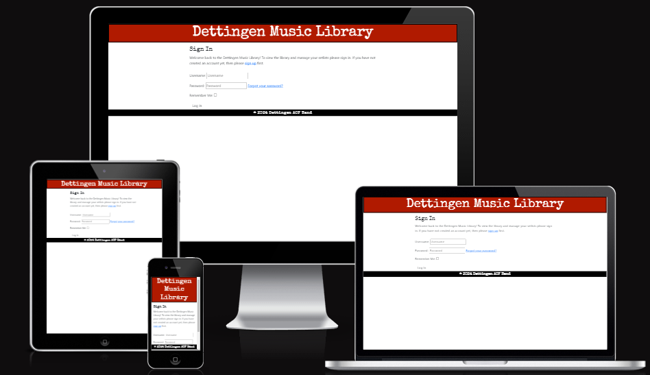
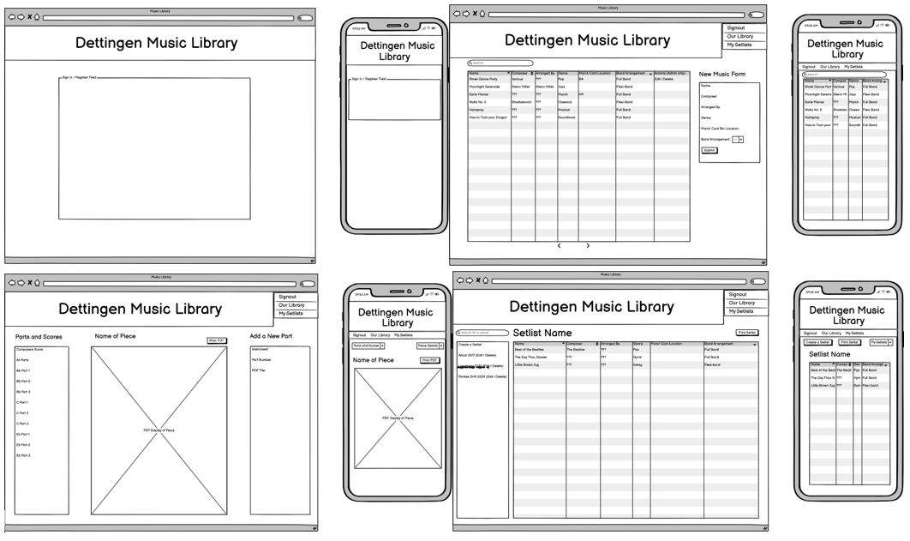
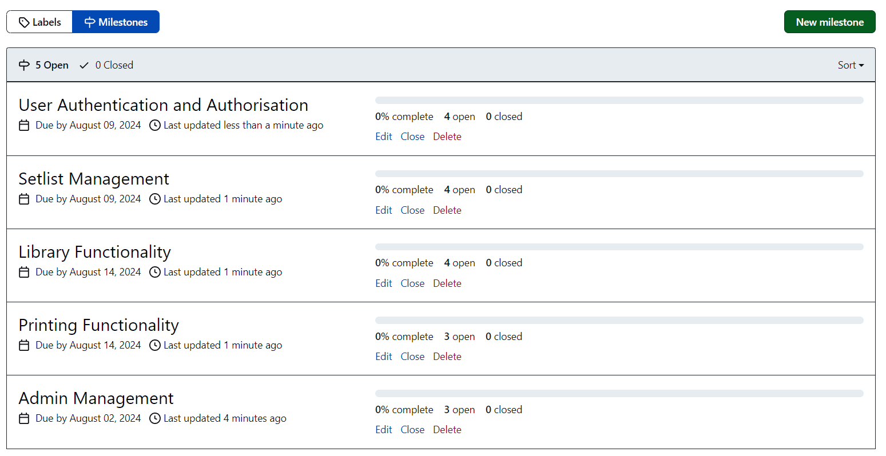

# Dettingen Music Library

The Dettingen Music Library has been created for my local Army Cadet Force Band in order to digitise their library and make rehearsals and gig preparation easier without the need to look through physical copies and lists to create a setlist.

This app was designed with the idea that they can filter their library for the music they want to add to a setlist for an upcoming concert or for personal practice. These pieces can then be viewed to see the parts available with a pdf copy that can be viewed in the site or printed.

In order to protect the library and the setlists people have created I've ensured that only those who are staff members can create, update and delete items in the library and all users only have access to the setlists that they have created.

## UX Design

The Dettingen Music Library App is designed to provide a user-friendly experience for musicians and administrators. The app allows users to browse, filter, and manage a comprehensive library of musical scores based on their user status. Key design considerations include:

-  **Intuitive Navigation:** Easy access to the music library, user created setlists, and administrative account management.

-  **Responsive Design:** Ensuring the app is accessible on various devices, including desktops, tablets, and smartphones.

-  **Clear Visual Hierarchy:** Use of consistent colours, typography, and spacing to guide users through the app's functionalities.

### Wireframe Design

I used a program called Balsamiq in order to create a wireframe to plan the main pages of my application.
During development I realised I had to make some stylistic and functional changes regarding the mobile view of the application in order to keep the responsivity consistent across different devices.

  

## Features

I used a miro board to create a flow chart of the different features and views that I wanted my app to have as well as the main installations that it could use as well as the criteria I wanted it to meet.

### User Authentication

-  **User Login:** Secure login for all users to access the app. No one who isn't logged in can access the app.

-  **Admin Login:** Additional privileges for admins to manage the library.

  

### Library Management (Admin Only)

-  **Add Items:** Admins can add new music scores to the library.

-  **Edit Items:** Admins can update existing music scores.

-  **Remove Items:** Admins can delete outdated or irrelevant scores.

  

### Setlist Management

-  **Create Setlist:** Users can create personalized setlists.

-  **Edit Setlist:** Users can modify their existing setlists.

-  **Delete Setlist:** Users can remove setlists they no longer need.

  

### Printing

-  **Print Library List:** Users can print a complete list of the music library.

-  **Print Setlist:** Users can print their setlists for use in rehearsals or performances.

-  **Print Individual Score Parts:** Users can print individual PDF parts for specific scores.

  

### Library Filtering
-  **Filter by Title:** Users can filter the library based on the title of a piece.

-  **Filter by Composer:** Users can filter the library based on a composer.

-  **Filter by Genre:** Users can filter the library based on musical genres.

-  **Filter by Band Arrangement:** Users can filter the library based on band arrangements.

  

### Location Information

-  **March Card Location:** Users can view the physical location of march card versions of scores.

### Future Features

- **Audio Playback:** Users can hear an audio of the selected piece that they can play along with

- **Global Setlists:** Admins can create a global setlist that is shared with all members of the band which will be useful for any upcoming gigs to save everyone creating a setlist.

## Github Repository

  

### Kanban Board

I created a kanban board to keep a track of my user stories and how I was progressing with them.

  

### Milestones

Milestones allowed me to organise my user stories into groups which I could apply a deadline to, to ensure I was on track with the correct development and features depending on priority.

  

### Roadmap

The roadmap feature provided me with the ability to see a visual representation of my user stories in their milestones based on the time frame I had set. It was easily adjustable for the time I wanted to spend on each task.

## Technologies

### Frontend

-  **CSS:** Styling the app to ensure a consistent and attractive user interface.

-  **HTML:** Structuring the app's content and layout.

-  **JavaScript:** Adding interactivity and dynamic elements to the app through the delete functions.

  

### Backend

-  **Django:** A high-level Python web framework for building the app's backend and managing the database.

-  **PostgreSQL:** A powerful, open-source object-relational database system for storing music scores and user data.

- **Google Drive Storage:** Storage through Google's cloud based system allowing for the upload and download of pdf files.

  

## Manual Testing Write-Up

### Testing Overview

Manual testing was conducted to ensure the app's features work as expected. The following aspects were tested:

-  **User Authentication:** Verified that users can log in, and that admins have additional privileges.

-  **Library Management:** Confirmed that admins can add, edit, and remove music scores.

-  **Setlist Management:** Ensured users can create, edit, and delete setlists.

-  **Printing Functionality:** Checked that users can print the library list, setlists, and individual score parts.

-  **Filtering:** Tested the filtering by genre and band arrangement to ensure accurate results.

-  **Location Information:** Verified that the location of march card versions is displayed correctly.

### Test Cases

1.  **Login/Logout:** Test valid and invalid login credentials, and ensure successful logout.

2.  **Add/Edit/Remove Library Items:** Test adding, editing, and removing music scores as an admin.

3.  **Create/Edit/Delete Setlist:** Test the creation, modification, and deletion of setlists.

4.  **Print Features:** Test printing the library list, setlists, and individual score parts.

5.  **Filter Library:** Test filtering the library by genre and band arrangement.

6.  **View Location:** Test displaying the location of march card versions.

### Results

All manual tests were passed successfully. Any issues found were promptly addressed and re-tested.

### Automatic Testing

42 automatic tests have been carried out to ensure everything is functioning correctly and that errors will be produced if one becomes invalid.

Automatic testing will allow me to easily and efficiently maintain my app by quickly being able to spot any issues if my tests fail.

### User/Peer Testing

I requested that the band I have produced the app for could fully test it on mobile and desktop devices and provide their feedback as first time users. The consensus was that the app is easy to navigate, usable across multiple devices and will be a major benefit to their organisation.

I asked for a senior software engineer to run his own test of my app and review the code and provide any feedback on what could be improved. These suggestions were then implemented.

Finally I asked my peers to review and test the functionality which yielded positive results with any bugs they flagged up (such as getting a server error) being rectified.

### Validator Testing

- HTML
    - No errors were returned when passing through the [W3C validator](https://validator.w3.org/)

- CSS
    - No errors were found when passing through the [(Jigsaw) validator](https://jigsaw.w3.org/css-validator/)

- Performance and Accessibility
    - I used google dev tools lighthouse to test for this.

    

## Deployment Using Heroku

### Prerequisites

- Heroku account

- Git installed locally

### Deployment Steps

1. Set up the application in Heroku

2. Add my config vars to settings

3. Link my github repository

4. Manual deploy from my main branch of my github repository

5. Redeploy everytime I have updated the code for the application

Deployed Link =  https://dettingen-music-library-9bff046c8600.herokuapp.com/

## Credits
I used various articles from the following sites to help with the creation and testing of my application.

- [Bootstrap Documentation](https://getbootstrap.com/docs/5.3/getting-started/introduction/)

- [Django Documentation](https://docs.djangoproject.com/en/5.1/)

- [SweetAlert2 Examples](https://sweetalert2.github.io/#examples)

- [Stack Overflow](https://stackoverflow.com/)

- [ChatGPT](https://chatgpt.com/)